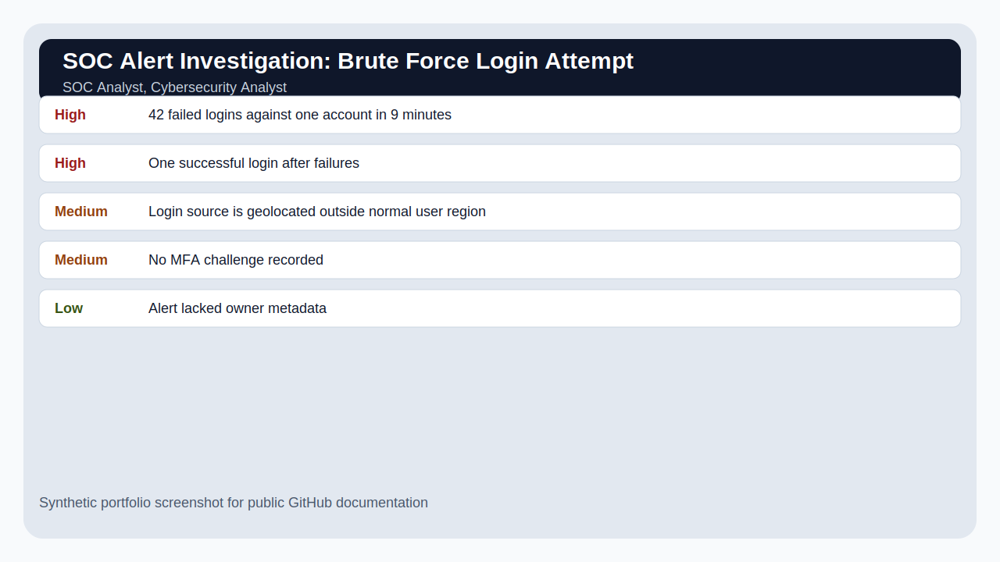

# SOC Alert Investigation: Brute Force Login Attempt

## Overview

A SOC-style investigation using synthetic authentication logs to triage failed logins, build a timeline, identify suspicious IP behavior, and recommend containment and hardening steps.

## Scenario

The security team receives an alert for repeated failed login attempts against a remote access service followed by one successful login.

## Target Roles

SOC Analyst, Cybersecurity Analyst

## Tools and Concepts Used

Splunk/Wazuh-style log review, Windows Event ID concepts, timeline analysis, incident note writing

## Key Findings

| Severity / Type | Finding | Why It Matters |
|---|---|---|
| High | 42 failed logins against one account in 9 minutes | Pattern strongly suggests password guessing. |
| High | One successful login after failures | Potential account compromise requiring validation. |
| Medium | Login source is geolocated outside normal user region | Anomaly increases suspicion. |
| Medium | No MFA challenge recorded | Control gap increases account takeover risk. |
| Low | Alert lacked owner metadata | Slowed triage and escalation. |

## What I Did

1. Defined the scope and business scenario.
2. Reviewed synthetic evidence/data.
3. Identified security issues and mapped them to business risk.
4. Prioritized findings by severity and likelihood.
5. Wrote remediation or improvement recommendations.
6. Documented the project in a way a recruiter, hiring manager, or technical reviewer can follow.

## Screenshots

## Interview Explanation

This project shows how I think like an analyst: confirm the alert, collect evidence, determine whether the activity is suspicious, document impact, and recommend practical next steps.

## How to Confidently Explain This Project

Use this structure:

1. **Situation:** Explain the business problem.
2. **Task:** Explain what security question you were trying to answer.
3. **Action:** Explain your investigation or review steps.
4. **Result:** Explain what you found and what you recommended.

Example:

> I created this project to practice the workflow used by security teams: define scope, collect evidence, identify risk, prioritize what matters, and communicate next steps. I used synthetic data so the project is safe to publish, but the process mirrors how entry-level analysts contribute in real environments.

## Beginner Mistakes This Project Avoids

- Listing tools without explaining the security outcome.
- Treating every alert or finding as equally important.
- Forgetting to explain business impact.
- Publishing real logs, IP addresses, client data, or secrets.
- Writing notes that only the author can understand.

## Files Included

- `README.md` - Project overview and explanation.
- `data/sample-data.csv` - Synthetic evidence used for the project.
- `reports/final-report.md` - Polished report-style writeup.
- `screenshots/project-summary.svg` - Public-safe screenshot mockup.
