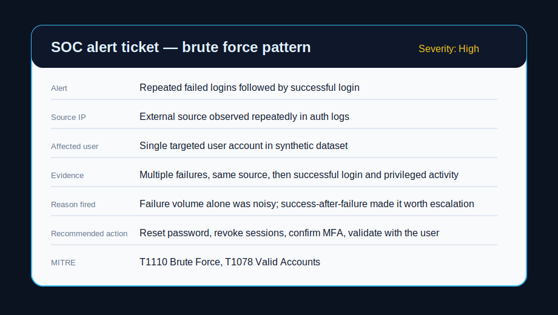
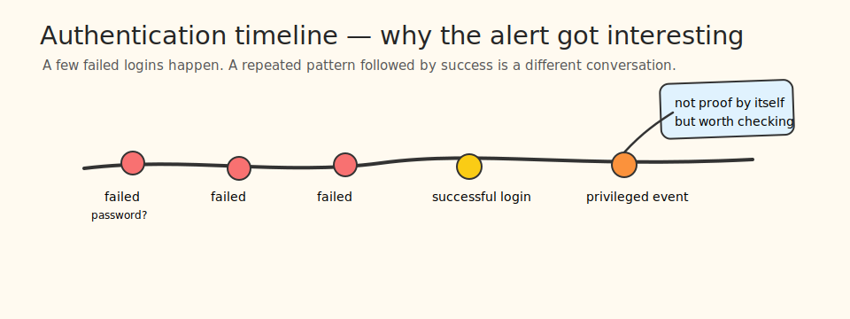
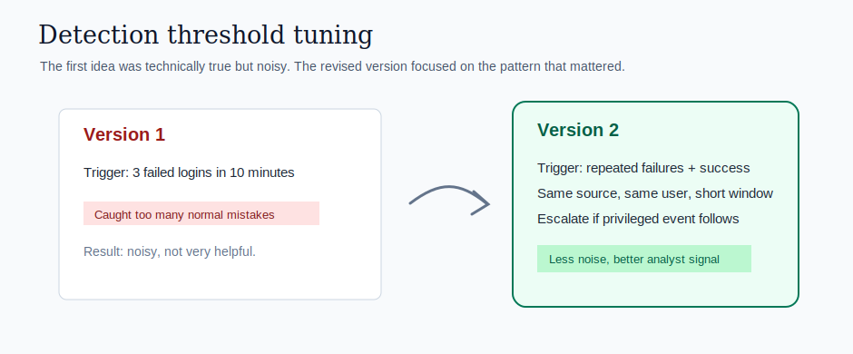
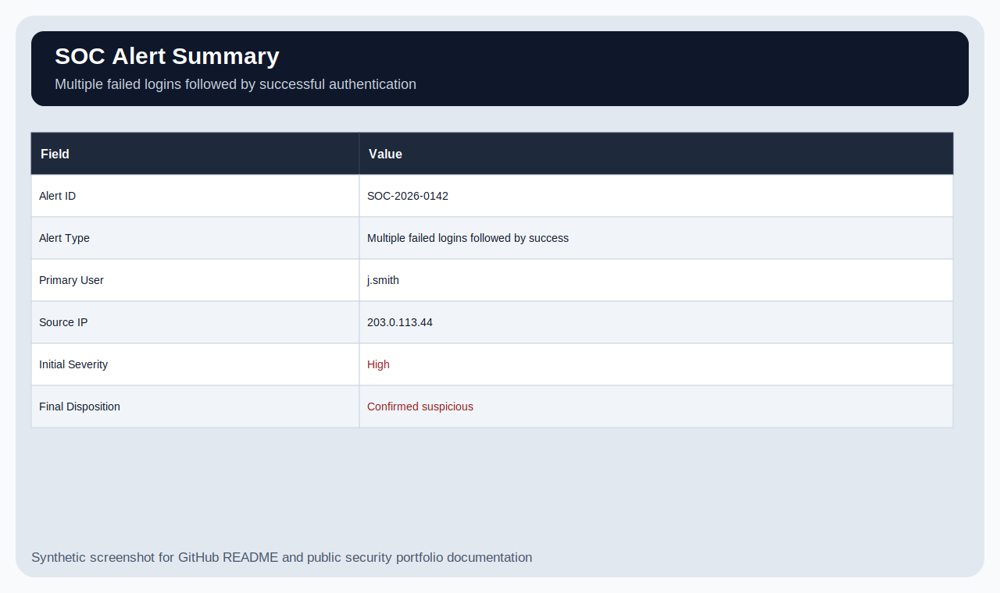
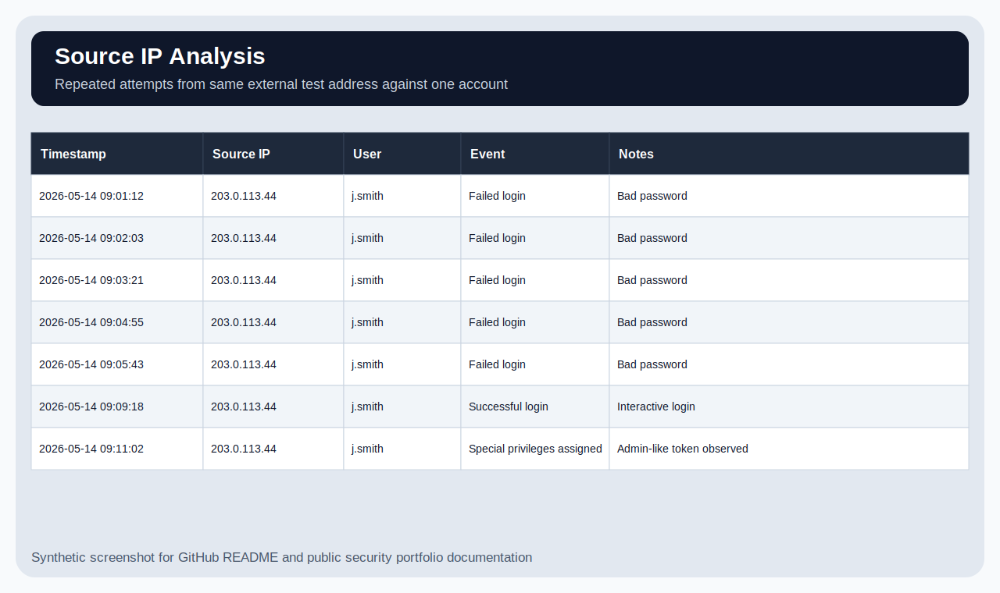
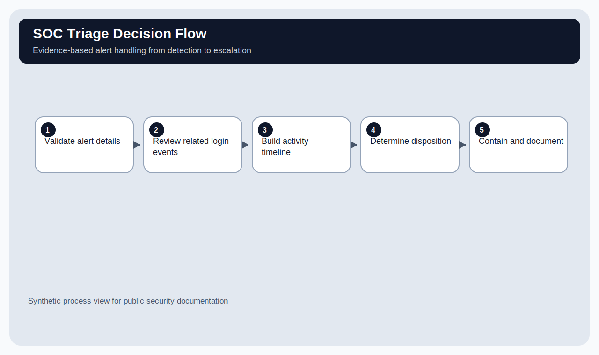
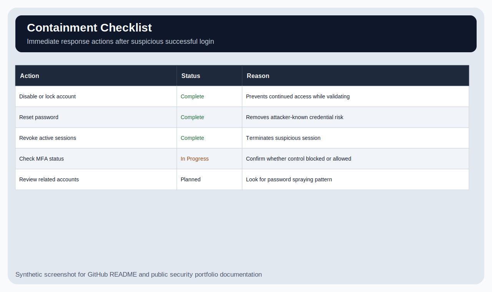

<div align="center">

# SOC Alert Investigation: Brute Force Login Attempt

**A junior SOC-style investigation using synthetic authentication evidence**  
Alert triage + timeline building + containment recommendations + honest disposition

   

</div>

---

## What this project demonstrates



This is a SOC triage lab using synthetic authentication logs. The alert involves repeated failed logins followed by a successful login for the same user.

The project focuses on the analyst workflow: check the alert, review related events, build a timeline, decide whether the activity is suspicious, and document containment steps. It does not claim a confirmed breach.

All users, IPs, and log events are synthetic.

---

## Skills used

| Skill | How it shows up here |
|---|---|
| Alert triage | Reviewed the alert and decided what evidence mattered. |
| Log analysis | Used authentication events to connect failed and successful login activity. |
| Timeline building | Ordered events to show how the activity changed over time. |
| Detection tuning | Reconsidered an overly noisy threshold and tightened the alert logic. |
| MITRE ATT&CK mapping | Mapped activity to brute force and valid account usage. |
| Incident response thinking | Recommended password reset, session revocation, MFA validation, and user confirmation. |
| Analyst communication | Wrote a disposition that does not overclaim compromise. |

**Estimated time to build/recreate:** ~6–9 hours across a few focused sessions.  
The trick was not finding failed logins. The trick was not yelling “breach” every time someone fat-fingers a password.

---

## Quick visual tour

| Timeline | Threshold tuning |
|---|---|
|  |  |

| Alert summary | Source IP analysis |
|---|---|
|  |  |

| Triage flow | Containment checklist |
|---|---|
|  |  |

---

## What triggered the review

A user account had several failed login attempts from the same external source, followed by a successful login. At first, this could have been a user mistyping a password, a saved password issue, or a remote access problem. The successful login after repeated failures made it more concerning.

---

## Evidence reviewed

| Evidence | Location |
|---|---|
| Authentication events | `data/authentication-events.csv` |
| Investigation timeline | `data/investigation-timeline.csv` |
| Alert summary | `alert-triage/alert-summary.md` |
| Event ID notes | `evidence/event-id-notes.md` |
| SIEM query examples | `detection-logic/siem-query-examples.md` |
| Containment plan | `response/containment-plan.md` |
| Final analyst report | `reports/final-report.md` |
| Analyst journal | `docs/analyst-journal.md` |

---

## One example SOC alert

| Field | Detail |
|---|---|
| Alert | Repeated failed logins followed by successful login |
| Severity | High for triage, pending validation |
| Source IP | External source observed repeatedly in the synthetic authentication logs |
| Affected user | Single targeted user account in the sample dataset |
| Evidence | Multiple failures from the same source, then a successful login and a privileged event afterward. |
| Reason fired | Failed logins alone were noisy; success-after-failure plus later activity increased concern. |
| Recommended action | Reset password, revoke sessions, confirm MFA, validate with the user, and review recent activity. |
| MITRE ATT&CK | T1110 Brute Force, T1078 Valid Accounts |

I would not declare compromise from this alert alone. I would escalate it as suspicious and validate the user, MFA status, source IP context, and post-login actions.

---

## Why severity increased

The failed logins alone were not enough to call this compromise. The severity increased because:

- The attempts targeted one account repeatedly.
- The same source IP was involved.
- A successful login occurred after the failures.
- A privileged event appeared shortly after the login.
- MFA status was not confirmed in the available evidence.

---

## Project structure

```text
SOC-Alert-Investigation-Brute-Force-Attempt/
├── alert-triage/                 # Alert summary and analyst notes
├── data/                         # Synthetic authentication events and timeline
├── detection-logic/              # SIEM query examples
├── docs/                         # Analyst journal and new portfolio visuals
│   └── images/                   # README visuals
├── evidence/                     # Event ID notes
├── reports/                      # Final analyst report
├── response/                     # Containment plan
├── screenshots/                  # Original SVG screenshots from the lab
└── README.md
```

---

## What I got wrong first

My first alert threshold was too sensitive. Three failed logins in ten minutes sounded reasonable until I thought about normal user mistakes, broken password managers, expired VPN sessions, and the general chaos of a regular workday.

I changed the focus to the chain: repeated failures, same source, successful login, and follow-on privileged activity. That made the alert more useful and less noisy.

More notes are in `docs/analyst-journal.md`.

---

## What I could confirm

- The login pattern was suspicious.
- The timeline supported escalation.
- Containment actions were appropriate for a potentially compromised account.

## What I could not confirm

- Whether the login was performed by the real user.
- Whether MFA was challenged or bypassed.
- Whether the account accessed sensitive data.
- Whether the source IP was malicious, VPN-related, or expected travel activity.

---

## Current disposition

**Confirmed suspicious activity pending user and MFA validation.**

The recommended response is to reset the password, revoke sessions, confirm MFA, check related account activity, and review whether the login was legitimate.

---

## What I would improve next since Rome did not brute-force its way into existence

1. Add a Splunk or Elastic version of the same investigation.
2. Include a benign false positive example for comparison.
3. Add MFA logs to strengthen the decision.
4. Add GeoIP or impossible travel context.
5. Add a short manager-facing summary of the incident.

---

## Important note

This is a defensive portfolio lab using fictional authentication data. It is meant to show investigation reasoning, not to claim real incident response experience.
