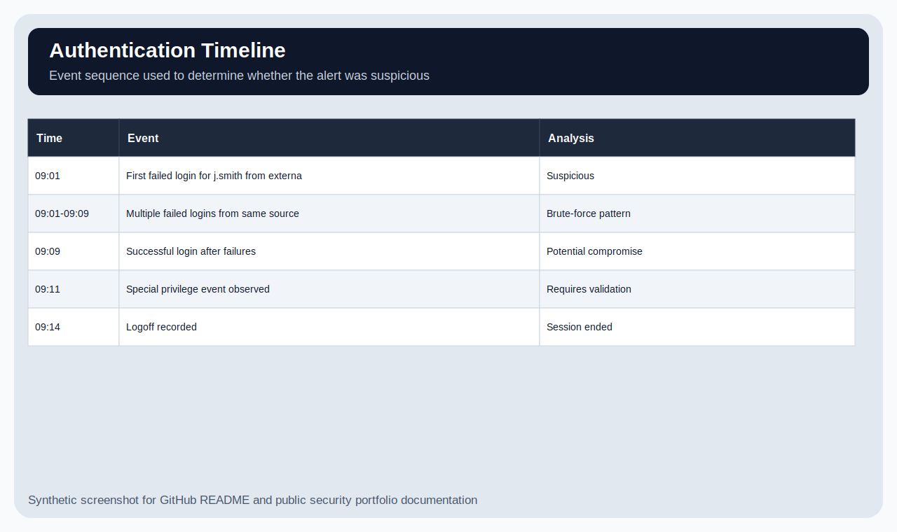

# SOC Alert Investigation: Brute Force Login Attempt

## Overview

This is a SOC triage lab using synthetic authentication logs. The alert involves repeated failed logins followed by a successful login for the same user.

The project focuses on the analyst workflow: check the alert, review related events, build a timeline, decide whether the activity is suspicious, and document containment steps. It does not claim a confirmed breach.

All users, IPs, and log events are synthetic.

---

## What triggered the review

A user account had several failed login attempts from the same external source, followed by a successful login. At first, this could have been a user mistyping a password, a saved password issue, or a remote access problem. The successful login after repeated failures made it more concerning.

---

## Evidence reviewed

| Evidence | Location |
|---|---|
| Authentication events | `data/authentication-events.csv` |
| Investigation timeline | `data/investigation-timeline.csv` |
| Alert summary | `alert-triage/alert-summary.md` |
| Event ID notes | `evidence/event-id-notes.md` |
| SIEM query examples | `detection-logic/siem-query-examples.md` |
| Containment plan | `response/containment-plan.md` |
| Final analyst report | `reports/final-report.md` |

---

## Screenshots

### Alert summary

### Authentication timeline

### Source IP analysis

### Triage decision flow

### Containment checklist

---

## Why severity increased

The failed logins alone were not enough to call this compromise. The severity increased because:

- The attempts targeted one account repeatedly.
- The same source IP was involved.
- A successful login occurred after the failures.
- A privileged event appeared shortly after the login.
- MFA status was not confirmed in the available evidence.

---

## What I could confirm

- The login pattern was suspicious.
- The timeline supported escalation.
- Containment actions were appropriate for a potentially compromised account.

## What I could not confirm

- Whether the login was performed by the real user.
- Whether MFA was challenged or bypassed.
- Whether the account accessed sensitive data.
- Whether the source IP was malicious, VPN-related, or expected travel activity.

---

## Current disposition

**Confirmed suspicious activity pending user and MFA validation.**

The recommended response is to reset the password, revoke sessions, confirm MFA, check related account activity, and review whether the login was legitimate.
